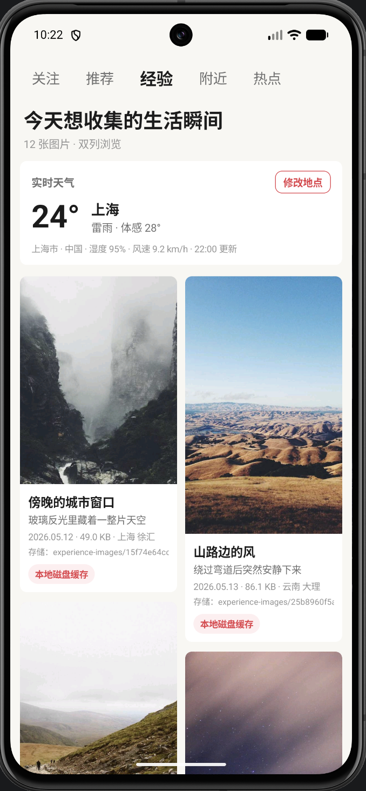
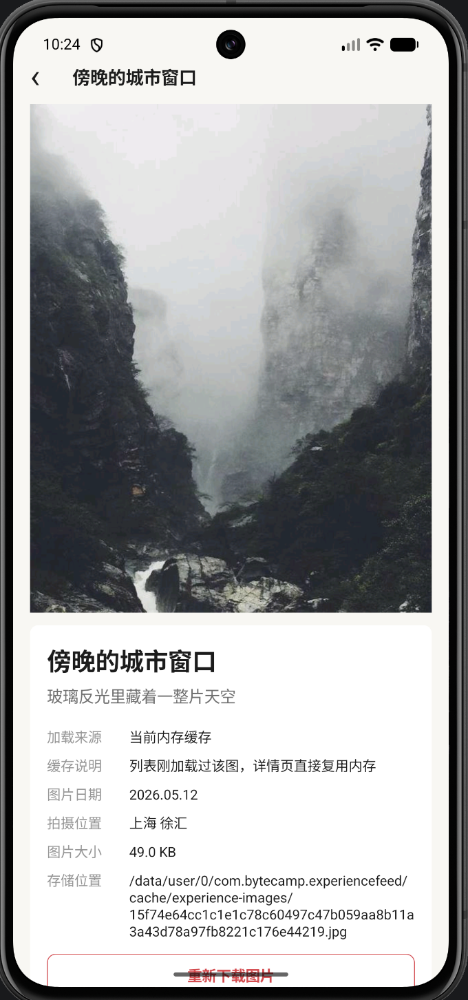
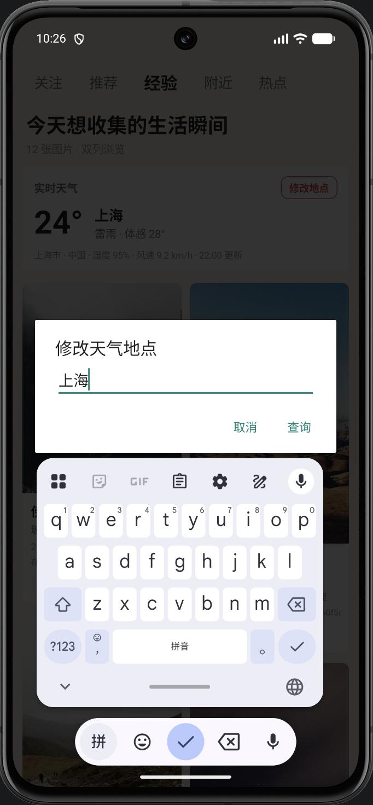

# Experience Feed Android

> 一个参考短视频内容社区「经验」信息流形态实现的 Android 图文浏览应用，包含双列图片流、图文详情页、实时天气、网络请求与多级缓存。

<p align="center">
  
  
  
  
  
</p>

---

## 目录

- [项目简介](#项目简介)
- [运行效果](#运行效果)
- [核心功能](#核心功能)
- [页面结构](#页面结构)
- [技术栈](#技术栈)
- [实现思路](#实现思路)
- [项目结构](#项目结构)
- [快速运行](#快速运行)
- [构建方式](#构建方式)
- [功能亮点](#功能亮点)
- [后续优化](#后续优化)

---

## 项目简介

Experience Feed Android 是一个原生 Android 图文内容流项目。应用首页模拟内容社区中的「经验」频道，展示双列图片流；点击图片卡片后进入详情页，查看大图、标题、描述、图片大小、拍摄位置和本地缓存路径。

项目同时加入了实时天气能力：经验页默认展示上海天气，用户可以手动修改城市，应用会保存上一次选择的地点。

这个项目重点展示 Android 基础开发中常见的几类能力：

- 页面布局与 Activity 跳转
- Retrofit + OkHttp 网络请求
- JSON 数据解析
- 图片下载、解码与缓存
- 异步任务与主线程 UI 更新
- 本地数据保存

---

## 运行效果

<table>
  <tr>
    <td align="center"><strong>首页双列图片流</strong></td>
    <td align="center"><strong>图文详情页</strong></td>
    <td align="center"><strong>修改天气地点</strong></td>
  </tr>
  <tr>
    <td align="center">
      
    </td>
    <td align="center">
      
    </td>
    <td align="center">
      
    </td>
  </tr>
  <tr>
    <td>首页展示顶部频道、实时天气卡片和双列图文内容。</td>
    <td>详情页展示大图、图文信息、缓存来源和本地路径。</td>
    <td>支持输入城市并刷新天气，城市选择会被保存。</td>
  </tr>
</table>

---

## 核心功能

| 模块 | 功能说明 |
| --- | --- |
| 双列图片流 | 首页以左右两列展示图文卡片，并按预估高度分配到较短的一列 |
| 图文详情页 | 点击卡片进入详情页，展示大图、标题、描述和图片信息 |
| 实时天气 | 默认展示上海天气，支持修改城市并保存选择 |
| 网络图片加载 | 使用 Retrofit 声明下载接口，OkHttp 执行真实请求 |
| 多级缓存 | 支持 OkHttp 响应缓存、Bitmap 内存缓存和本地磁盘缓存 |
| 加载来源展示 | 首页和详情页展示图片来自网络、HTTP 缓存、磁盘缓存或内存缓存 |
| 手动重载 | 详情页可以清除当前图片缓存并重新下载 |
| 异常处理 | 对网络失败、空响应、解码失败和城市查询失败做了提示处理 |

---

## 页面结构

```text
Experience Feed
├── 首页
│   ├── 顶部频道 Tab
│   ├── 页面标题
│   ├── 实时天气卡片
│   └── 双列图片流
│       ├── 图片
│       ├── 标题
│       ├── 描述
│       ├── 日期 / 大小 / 位置
│       └── 加载来源
└── 详情页
    ├── 顶部返回栏
    ├── 大图预览
    ├── 图文描述
    ├── 图片元信息
    ├── 缓存路径
    └── 重新下载按钮
```

---

## 技术栈

| 类型 | 技术 |
| --- | --- |
| 开发语言 | Java |
| 页面实现 | Android 原生 View、Activity、动态布局 |
| 网络请求 | Retrofit、OkHttp |
| JSON 解析 | Gson Converter |
| 图片处理 | BitmapFactory |
| 内存缓存 | LruCache |
| 磁盘缓存 | 应用私有缓存目录 |
| HTTP 缓存 | OkHttp Cache |
| 本地存储 | SharedPreferences |
| 图片来源 | Picsum Photos |
| 天气来源 | Open-Meteo |

---

## 实现思路

### 图片加载流程

图片加载逻辑统一收敛在 `ImageRepository` 中，页面不直接处理网络请求和文件读写。

```text
请求图片
  ↓
检查 Bitmap 内存缓存
  ↓ 未命中
检查本地图片文件缓存
  ↓ 未命中
通过 Retrofit + OkHttp 请求网络图片
  ↓
写入本地缓存文件
  ↓
BitmapFactory 解码
  ↓
回到主线程更新页面
```

图片缓存文件使用图片 URL 的 SHA-256 值命名。这样可以保证同一个 URL 对应同一个缓存文件，同时避免 URL 中的特殊字符影响文件路径。

### 天气请求流程

天气接口需要经纬度，而用户输入的是城市名称，所以天气请求被拆成两步：

```text
城市名称
  ↓
城市搜索接口
  ↓
经纬度
  ↓
实时天气接口
  ↓
温度 / 天气 / 湿度 / 风速
```

`WeatherRepository` 负责串联城市搜索和实时天气请求，并把天气代码转换成中文描述。用户修改后的城市会保存到 `SharedPreferences`，下次启动时继续使用。

### 缓存层级

```text
Bitmap 内存缓存
  ↓
本地图片文件缓存
  ↓
OkHttp HTTP 响应缓存
  ↓
真实网络请求
```

首页和详情页会展示当前图片的加载来源，方便观察缓存是否生效。

---

## 项目结构

```text
app/src/main/java/com/bytecamp/experiencefeed/
├── MainActivity.java           # 首页、天气卡片、双列图片流
├── DetailActivity.java         # 图文详情页
├── ImageRepository.java        # 图片请求、图片解码和多级缓存
├── ImageDownloadService.java   # Retrofit 图片下载接口
├── WeatherRepository.java      # 城市搜索、天气查询和结果转换
├── WeatherService.java         # Retrofit 天气接口
├── FeedData.java               # 示例图文数据
├── ImagePost.java              # 图文数据模型
├── ImageLoadResult.java        # 图片加载结果
├── CacheSource.java            # 加载来源枚举
└── UiKit.java                  # UI 尺寸、颜色、圆角和系统栏工具
```

---

## 快速运行

1. 克隆项目到本地。
2. 使用 Android Studio 打开项目根目录。
3. 等待 Gradle Sync 完成。
4. 创建或选择 Android 模拟器。
5. 选择 `app` 运行配置并点击运行。

项目需要网络权限，用于请求图片和实时天气数据。

---

## 构建方式

```bash
./gradlew assembleDebug
```

主要依赖：

```gradle
implementation "com.squareup.okhttp3:okhttp:4.12.0"
implementation "com.squareup.retrofit2:retrofit:2.11.0"
implementation "com.squareup.retrofit2:converter-gson:2.11.0"
```

---

## 功能亮点

- 没有直接使用第三方图片库，图片请求、解码和缓存链路都在项目中显式实现。
- 使用 Retrofit 处理两类请求：图片原始数据下载和天气 JSON 数据查询。
- OkHttp 拦截器统一处理请求头、日志和响应缓存策略。
- 首页与详情页复用同一个图片仓库，缓存命中逻辑保持一致。
- 天气功能支持城市搜索、实时天气查询和本地保存。
- 页面主动处理状态栏和导航栏安全区域，避免内容贴边或遮挡。

---

## 后续优化

- 使用 `RecyclerView + StaggeredGridLayoutManager` 替换当前手动双列布局。
- 增加分页加载和下拉刷新。
- 增加失败占位图和自动重试。
- 对大图进行采样解码，进一步降低内存压力。
- 增加定位权限支持，根据当前位置自动展示天气。
- 为本地磁盘缓存增加容量限制和过期清理策略。
